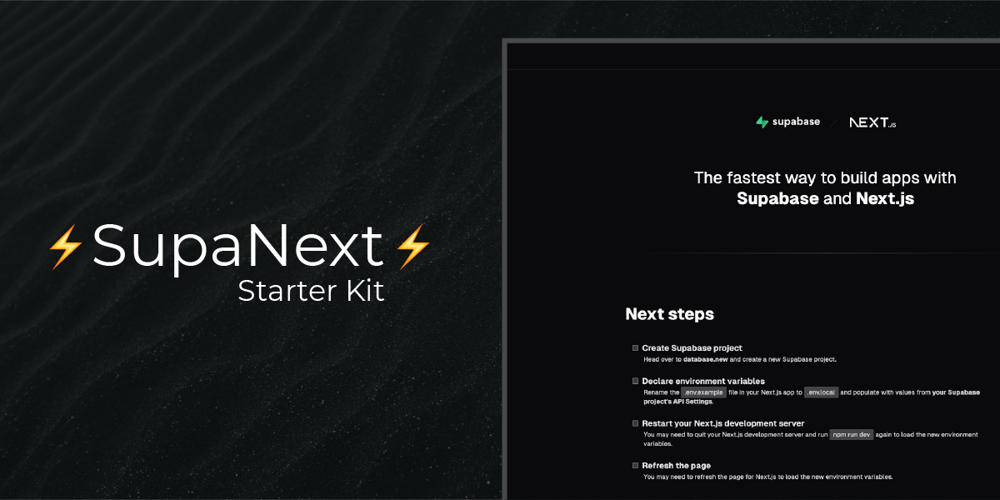

<p align="center">
  
</p>

<h1 align="center">⚡ Supabase Next.js Starter Kit ⚡</h1>

<p align="center">
  <a href="https://github.com/mrclrchtr/supabase-nextjs-starter/blob/main/LICENSE">
    
  </a>
  <a href="https://github.com/mrclrchtr/supabase-nextjs-starter/actions/workflows/ci.yml">
    
  </a>
  
  
  
  
</p>

<p align="center">
  A production-ready starter for building apps with Next.js 16 and Supabase.
</p>

<p align="center">
  It includes SSR-friendly Supabase auth, protected routes, Tailwind 4, shadcn-style UI primitives, TanStack Query, Vitest, Biome, pinned local tooling with mise, and CI workflows for app checks and Supabase migrations.
</p>

<div align="center">
  <a href="https://github.com/mrclrchtr/supabase-nextjs-starter"><strong>Repository</strong></a>
  ·
  <a href="#quick-start"><strong>Quick start</strong></a>
  ·
  <a href="#supabase-ssr-auth-and-nextjs-proxy"><strong>Auth + Proxy</strong></a>
  ·
  <a href="https://github.com/mrclrchtr/supabase-nextjs-starter/issues"><strong>Issues</strong></a>
</div>

<br />

## Features

- ⚡️ [Next.js](https://nextjs.org/) 16 with the App Router
- 💚 [Supabase](https://supabase.com/) auth with `@supabase/ssr`
- ⚛️ [React](https://react.dev/) 19
- ⛑  [TypeScript](https://www.typescriptlang.org/)
- 🎨 [Tailwind CSS](https://tailwindcss.com/) 4
- 🔌 [shadcn/ui](https://ui.shadcn.com/) style primitives
- 🪝 [TanStack Query](https://tanstack.com/query/latest) and React Query Devtools
- ⚪⚫ Dark mode with [next-themes](https://github.com/pacocoursey/next-themes)
- ✨ [Next Top Loader](https://github.com/TheSGJ/nextjs-toploader) for route transitions
- 🧪 [Vitest](https://vitest.dev/), [Testing Library](https://testing-library.com/), and [MSW](https://mswjs.io/)
- 🧹 [Biome](https://biomejs.dev/) for linting and formatting
- 🔍 [Knip](https://knip.dev/) for dependency analysis
- 🧰 [mise](https://mise.jdx.dev/) for pinned local and CI tooling
- 🪝 [hk](https://hk.jdx.dev/) for git hooks and local quality checks
- 👷 [GitHub Actions](https://github.com/features/actions) CI for linting, typechecking, dependency checks, tests, and build verification
- 🗄️ Supabase DB push workflow for tracked migrations
- 🔋 Bundle analysis and [Vercel Analytics](https://vercel.com/analytics)

## Quick start

### 1. Clone the repository

```bash
git clone https://github.com/mrclrchtr/supabase-nextjs-starter.git
cd supabase-nextjs-starter
```

### 2. Install the pinned toolchain and dependencies

```bash
mise install
pnpm install
```

If you want the local git hooks as well:

```bash
hk install --mise
```

### 3. Configure environment variables

Copy `.env.example` to `.env.local` and set your Supabase values:

```bash
cp .env.example .env.local
```

```bash
NEXT_PUBLIC_SUPABASE_URL=[INSERT SUPABASE PROJECT URL]
NEXT_PUBLIC_SUPABASE_PUBLISHABLE_KEY=[INSERT SUPABASE PROJECT API PUBLISHABLE KEY]
```

You can find both values in your Supabase project settings under API.

### 4. Start the app

```bash
pnpm dev
```

The app will be available at [http://localhost:3000](http://localhost:3000).

## Requirements

Preferred setup:

- [mise](https://mise.jdx.dev/)
- Node.js
- pnpm

If you do not use mise, install compatible versions of Node.js and pnpm manually.

## Environment variables and auth redirects

This starter currently requires these public Supabase variables:

- `NEXT_PUBLIC_SUPABASE_URL`
- `NEXT_PUBLIC_SUPABASE_PUBLISHABLE_KEY`

For first setup, `src/utils/env.ts` includes a temporary fallback so the app can render setup guidance before the env vars are configured. Treat that as onboarding convenience, not as the long-term production pattern.

If you use the built-in auth flows, configure these redirect URLs in the Supabase dashboard:

- `/protected` for email sign-up confirmation
- `/auth/update-password` for password reset

Relevant implementation:

- `src/components/sign-up-form.tsx`
- `src/components/forgot-password-form.tsx`
- `src/components/update-password-form.tsx`

## Supabase SSR auth and Next.js Proxy

Starting with Next.js 16, Middleware is now called **Proxy**. This repository uses `proxy.ts` together with `src/supabase/proxy.ts` to keep Supabase sessions in sync for SSR routes.

Why this exists:

- Server Components can read cookies, but they cannot write refreshed auth cookies back to the browser.
- Supabase recommends using Next.js Proxy to refresh auth state for SSR.
- The proxy calls `supabase.auth.getClaims()` and propagates refreshed cookies through both the request and the response.

This keeps the browser session and server-rendered session aligned and helps protect routes like `/protected`.

Relevant files:

- `proxy.ts`
- `src/supabase/proxy.ts`
- `src/supabase/server.ts`
- `src/app/protected/page.tsx`

## Built-in flows

This starter already includes:

- sign up
- login
- forgot password
- update password
- auth confirmation route
- a protected page that requires an authenticated user

Auth pages live under `src/app/auth`, and the protected example lives at `src/app/protected/page.tsx`.

## Tooling workflow

This repository uses:

- `mise` to pin developer tooling locally and in CI
- `hk` to run git hooks
- `Biome` for linting and formatting
- `Knip` for unused dependency checks
- `Vitest` for tests

Recommended bootstrap:

```bash
mise install
pnpm install
hk install --mise
```

## Scripts

- `pnpm dev` — Start the app in development mode at `http://localhost:3000`
- `pnpm build` — Create an optimized production build
- `pnpm start` — Start the production server
- `pnpm biome` — Run Biome checks
- `pnpm biome:fix` — Run Biome and apply fixes
- `pnpm biome:ci` — Run Biome in CI mode
- `pnpm typecheck` — Run the TypeScript compiler without emitting files
- `pnpm test` — Start Vitest in watch mode
- `pnpm test:ci` — Run Vitest once for CI or local verification
- `pnpm test:ui` — Start the Vitest UI
- `pnpm knip` — Check for unused dependencies
- `pnpm check` — Run the main local quality gate (`biome:ci`, `typecheck`, `knip`, `test:ci`)
- `pnpm check:fix` — Apply Biome fixes, then run the full quality gate
- `pnpm analyze` — Build the project with bundle analysis enabled

## Git hooks

`hk.pkl` defines the local hook workflow:

- `pre-commit` runs safety and formatting checks
- `pre-push` runs `biome:ci` and `typecheck`

Useful commands:

```bash
hk install --mise
hk run check
hk run fix
```

## CI

GitHub Actions runs the following checks on pushes and pull requests to `main`:

- `pnpm biome:ci`
- `pnpm typecheck`
- `pnpm knip`
- `pnpm test:ci`
- `pnpm build`

The CI workflow uses:

- `mise` to install the pinned toolchain
- explicit pnpm store caching via `actions/cache`
- `pnpm install --frozen-lockfile` for reproducible installs

Relevant workflow:

- `.github/workflows/ci.yml`

## Supabase migrations and DB push

This repository tracks migrations under:

```text
supabase/migrations/
```

A dedicated GitHub Actions workflow, `Supabase DB Push`, runs automatically on pushes to `main` when files in `supabase/migrations/**` change. You can also trigger it manually with `workflow_dispatch`.

To use that workflow, configure these GitHub repository secrets:

- `SUPABASE_ACCESS_TOKEN`
- `SUPABASE_DB_PASSWORD`
- `SUPABASE_PROJECT_REF`

The workflow uses the Supabase CLI to:

1. link to the target project
2. run `supabase db push`

Relevant workflow:

- `.github/workflows/supabase-db-push.yml`

## Project structure

```text
src/
  app/          Next.js routes and layouts
  components/   UI components and auth forms
  hooks/        Client hooks
  mocks/        MSW handlers for tests
  providers/    App-wide providers
  supabase/     Client, server, and Proxy helpers
  test/         Test utilities
supabase/
  migrations/   Tracked Supabase migrations
```

## Paths

TypeScript path mapping is configured with the `@` prefix for `src` imports.

```tsx
import { Button } from "@/components/ui/button";
```

## License

This project is licensed under the MIT License. See [LICENSE](LICENSE) for details.

## Feedback and issues

Please file issues here:

- https://github.com/mrclrchtr/supabase-nextjs-starter/issues
